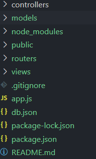

## 简单CRUD实现


### 1.技术栈
- node.js+express+MongoDB+art-templates+bootstrap

### 2. 起步

+ `app.js`是入口文件

+ `npm`命令安装其他包

+ 文件构成



+ 路由设计

  

### 3.功能的实现原理

1. 添加操作
    - get请求获取页面
    - 因为mongoose中`save`之前要`new`一个对象，而这个对象可以通过`req.body`来把表单输入的值进行转换为对象
    - post请求中对输入的值进行`new Topic(req.body).save(function(err){...})`保存,这样就可以把数据存入数据库中
    
2. 编辑操作
    - 数据库中分每个对象会自动生成的id
    - get请求中通过`findById`来查找指定数据
    - post请求中通过`findByIDAndUpdate`来更新数据库中的数据

3. 删除操作
	
- 通过获取id来删除
	
	- get请求中通过`req.query.id`来获取id再用`deleteOne`来删除指定数据
	
4. 查询操作

  - MongoDB中的模糊查询为`username：/值/`

  - 实现简单模糊查询，用户输入的值通过`var str="^.*"+req.query.title+".*$"`来转换获取

  - nodejs中，必须要使用RegExp，来构建正则表达式对象

    ```javascript
    var reg = new RegExp(str)
     Topic.find({
            title: reg
        }, function (err, topics) {
            if (err) {
                return next(err)
            }
            res.render('index.html', {
                topics: topics,
                user: req.session.user
            })
        })
    ```

5. 登录状态的实现
   - 由于`node.js`默认不支持`session`和`cookie`通过安装第三方包`express-session`来实现

   - ```javascript
     let session = require('express-session')
     
     app.use(session({
         //配置加密字符串，在原有加密基础上与这个字符串拼起来加密
       secret: 'keyboard cat',
       resave: false,
       //决定钥匙分配，true：无论是否使用session都会分配钥匙
       //false:使用session后才会分配钥匙
       saveUninitialized: true
     }))
     //配置成功，可以使用了
     ```
	- 验证成功时，添加状态
     ```javascript
     req.session.user = user 
     ```

   - 用户退出时，清除状态

     ```javascript
   	req.session.user = null
     ```

     
### 遇到的问题
1. 首页上使用模板引擎`{{each topic}}`遍历数据库中的`topics`集合渲染失败 
- 解决方法：在get首页的时候需要先查找数据库(find),再在渲染中(render)赋值(topics:topics)；同样`models`中的`topic.js`也要挂载到首页路由中

2. 每次调试登录状态会消失，得重新登录

+ 默认session是内存存储，服务器重启会丢失，真正生产环境会把session进行持久化存储。

3. art-template的render只能访问到views文件目录下的的页面，子文件的页面无法访问

+ 未解之谜...

